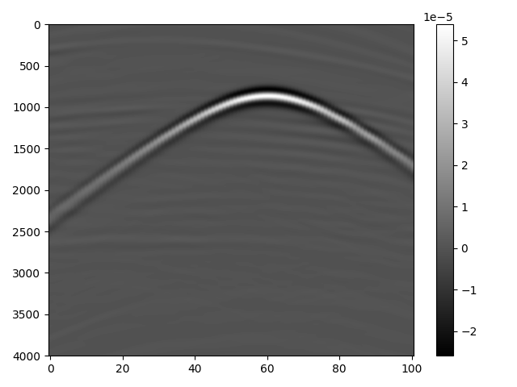

# View Data
Scripts view the data from geophysicists results

## View Model

### How to run:
``````
python3 view_model.py param_model.txt
``````

### Format of param_model.txt
* name of velocity model
* folder wich the images will saved
* nz of the initial velocity model
* ny of the initial velocity model
* nx of the initial velocity model

#### Example of param_model.txt
``````
../data/view/dobs_v401.bin
../data/view/figures/
201
201
201
``````
### Plots example

<p align="center">
  
  
</p>

## View Seismogram

### How to run:
``````
python3 view_seismogram.py param_seismogram.txt
``````

### Format of param_model.txt
* path from the seismogram file (dobs.bin)
* folder wich the plots will saved
* number of shots (n_src)
* number of samples in time (ns)
* receiver inital coordinate in x (gxi)
* receiver final coordinate in x (gxf)

### Example of param_model.txt
``````
../data/view/dobs_v401.bin
../data/view/figures/
16
401
0
201
``````
### Plots example

<p align="center">
  
</p>

